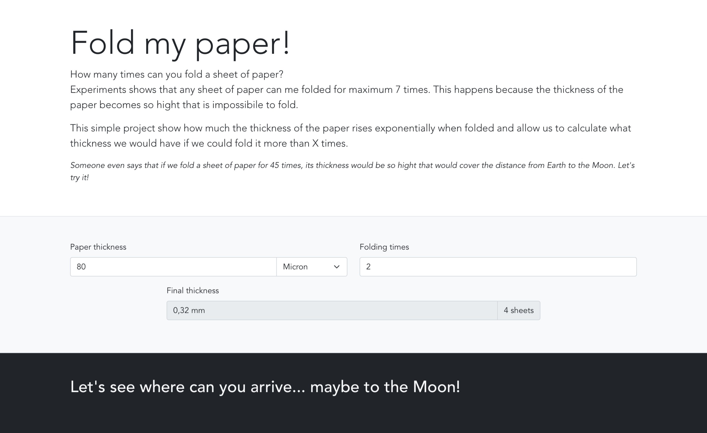
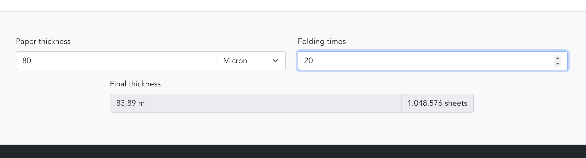
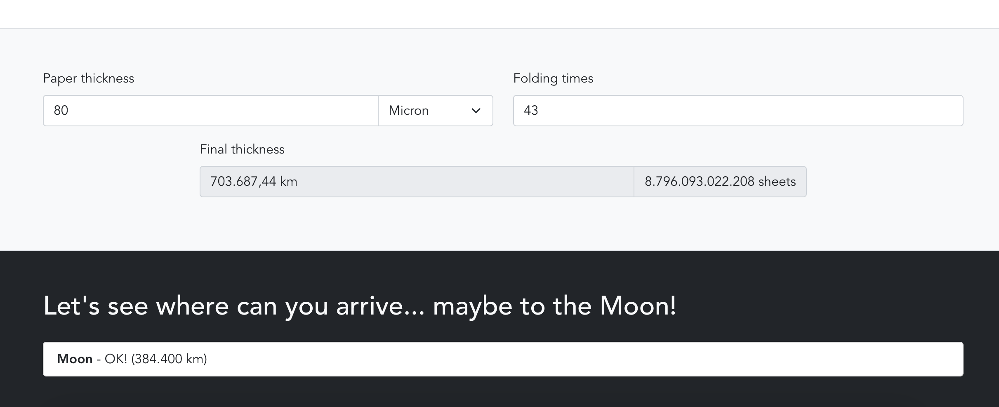
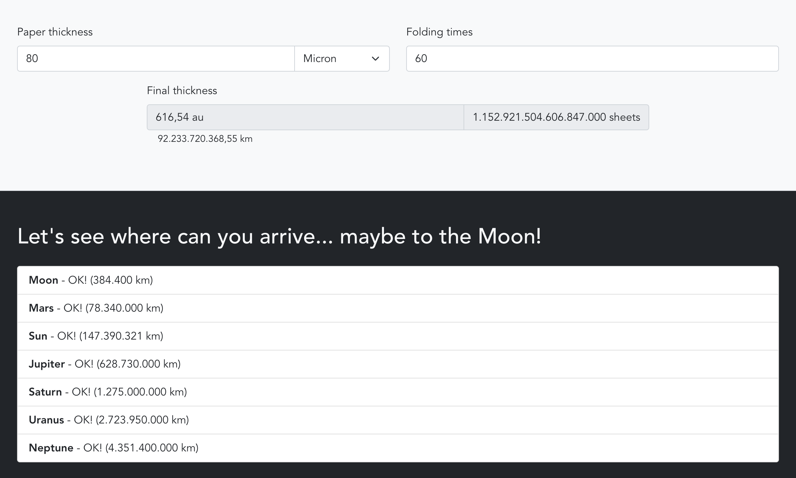

# Fold my paper!

How many times can you fold a sheet of paper?
Experiments shows that any sheet of paper can me folded for maximum 7 times. This happens because the thickness of the paper becomes so hight that is impossibile to fold.

This simple project show how much the thickness of the paper rises exponentially when folded and allow us to calculate what thickness we would have if we could fold it more than X times.

Someone even says that if we fold a sheet of paper for 45 times, its thickness would be so hight that would cover the distance from Earth to the Moon. Let's try it!

Live demo at [leicaflorian.github.io/fold_my_paper](https://leicaflorian.github.io/fold_my_paper/)

## Project setup

Install dependencies

```
npm install
```

Compiles and hot-reloads for development

```
npm run serve
```

## Screens

Basic page


x20 folding


x43 folding


x60 folding

